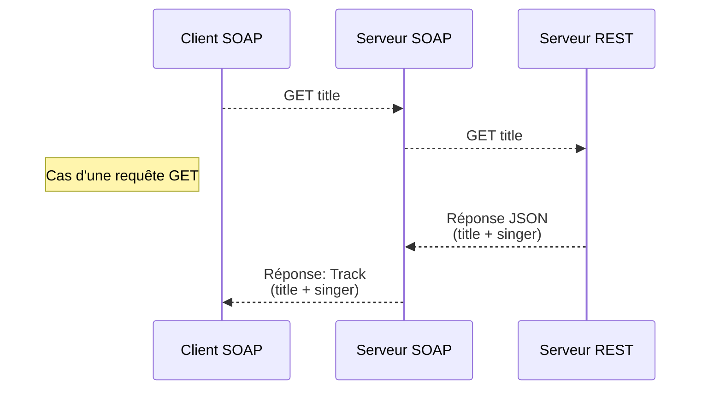
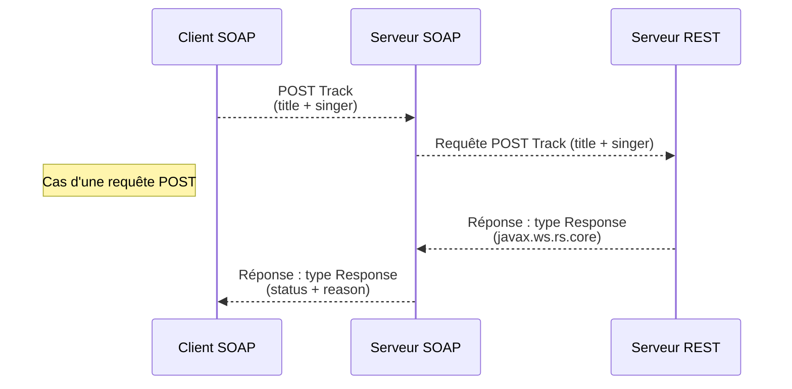

# Web services  SOAP et REST


## Besoin 

Réaliser 2 serveurs web REST et SOAP et un client SOAP.
Le processus est le suivant : 






## Pré-requis

Vous aurez besoin d'avoir installé au préalable:

*  Tomcat version 7.0.109 

  > Sous linux : https://archive.apache.org/dist/tomcat/tomcat-7/v7.0.109/bin/
  >
  > Sous Windows : https://archive.apache.org/dist/tomcat/tomcat-7/v7.0.109/bin/apache-tomcat-7.0.109.exe

* Java 8

  > Sous linux :  https://www.oracle.com/java/technologies/downloads/#java8-linux
  >
  > Sous windows:  https://www.oracle.com/java/technologies/downloads/#java8-windows

* Maven 3.8.4 

  > Suivez les instructions sur cette page : https://maven.apache.org/install.html


## Génération des paquets

1. Lancer les commandes suivantes dans un terminal pointant sur le répertoire de votre choix :

   > git clone https://github.com/MaximeDzN/trackSoapRest.git

   Allez dans le répertoire du projet, toujours à l'aide du terminal :

   > mvn package

 2. Les paquets ont été générés dans le répertoire RELEASE: 

    > SOAPServer.war
    >
    > RESTServer.war 
    >

## Usage

1. **Déployer les fichiers suivants dans un serveur Tomcat :**

   > SOAPServer.war
   >
   > RESTServer.war 
   

 2. **Vérifier que le déploiement du Serveur SOAP est réussi en cliquant sur le lien suivant :**

    > http://localhost:8080/SOAPServer/track

    Vous devriez voir une page html avec un contenu semblable à celui ci :

     

    

3. **Vérifier que le déploiement du Serveur REST est réussi en cliquant sur le lien suivant : **

   > http://localhost:8080/RESTServer/track/sandman

   Vous devriez voir une page html avec un contenu semblable à celui ci :

   ```json
   {"title":"Enter Sandman","singer":"Metallica"}
   ```

4. **Nous allons maintenant lancer le client SOAP exécutant le fichier SOAPClient.jar à l'aide de Java :**

   > ##### Dans un terminal, 
   >
   > java -jar SOAPClient.jar

   Vous devriez avoir un retour du programme semblable à ceci :

   ```bash
   Metallica Enter Sandman
   201 Crée
   ```
